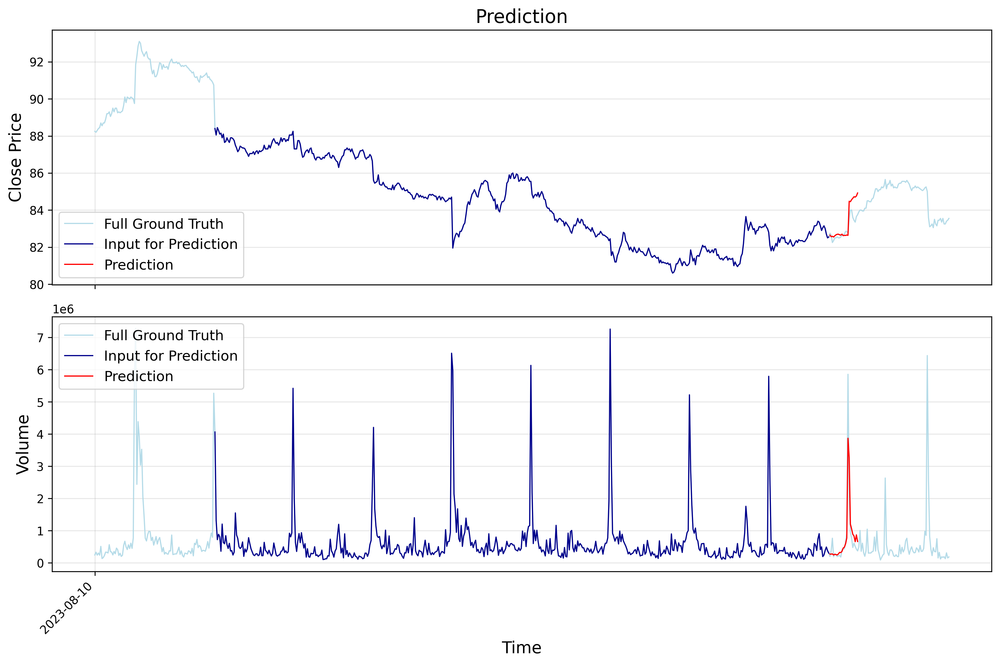

# Kronos Fine-tuning on Custom CSV Datasets

This module provides a comprehensive pipeline for fine-tuning Kronos models on your own CSV-formatted financial data. It supports both sequential training (tokenizer followed by predictor) and individual component training, with full distributed training capabilities.


## 1. Data Preparation

### Required Data Format

Your CSV file must contain the following columns in this exact order:
- `timestamps`: DateTime stamps for each data point
- `open`: Opening price
- `high`: Highest price
- `low`: Lowest price  
- `close`: Closing price
- `volume`: Trading volume
- `amount`: Trading amount

(volume and amount can be 0 if not available)

### Sample Data Format

| timestamps | open | close | high | low | volume | amount |
|------------|------|-------|------|-----|--------|--------|
| 2019/11/26 9:35 | 182.45215 | 184.45215 | 184.95215 | 182.45215 | 15136000 | 0 |
| 2019/11/26 9:40 | 184.35215 | 183.85215 | 184.55215 | 183.45215 | 4433300 | 0 |
| 2019/11/26 9:45 | 183.85215 | 183.35215 | 183.95215 | 182.95215 | 3070900 | 0 |

> **Reference**: Check `data/HK_ali_09988_kline_5min_all.csv` for a complete example of the proper data format.


## 2. Config Preparation


Please edit the correct data path and set your training parameters.

```yaml
# Data configuration
data:
  data_path: "/path/to/your/data.csv"
  lookback_window: 512        # Historical data points to use
  predict_window: 48           # Future points to predict
  max_context: 512            # Maximum context length

...

```
There are some other settings here, please see `configs/config_ali09988_candle-5min.yaml` for more comments.

## 3. Training

### Method 1: Sequential Training (Recommended)

The `train_sequential.py` script handles the complete training pipeline automatically:

```bash
# Complete training (tokenizer + predictor)
python train_sequential.py --config configs/config_ali09988_candle-5min.yaml

# Skip existing models
python train_sequential.py --config configs/config_ali09988_candle-5min.yaml --skip-existing

# Only train tokenizer
python train_sequential.py --config configs/config_ali09988_candle-5min.yaml --skip-basemodel

# Only train predictor
python train_sequential.py --config configs/config_ali09988_candle-5min.yaml --skip-tokenizer
```

### Method 2: Individual Component Training

Train each component separately for more control:

```bash
# Step 1: Train tokenizer
python finetune_tokenizer.py --config configs/config_ali09988_candle-5min.yaml

# Step 2: Train predictor (requires fine-tuned tokenizer)
python finetune_base_model.py --config configs/config_ali09988_candle-5min.yaml
```

### DDP Training

For faster training on multiple GPUs:

```bash
# Set communication backend (nccl for NVIDIA GPUs, gloo for CPU/mixed)
DIST_BACKEND=nccl \
torchrun --standalone --nproc_per_node=8 train_sequential.py --config configs/config_ali09988_candle-5min.yaml
```

## 4. Training Results

The training process generates several outputs:

### Model Checkpoints
- **Tokenizer**: Saved to `{base_save_path}/{exp_name}/tokenizer/best_model/`
- **Predictor**: Saved to `{base_save_path}/{exp_name}/basemodel/best_model/`

### Training Logs
- **Console output**: Real-time training progress and metrics
- **Log files**: Detailed logs saved to `{base_save_path}/logs/`
- **Validation tracking**: Best models are saved based on validation loss

## 5. Prediction Vis

The following images show example training results on alibaba (HK stock) data:





